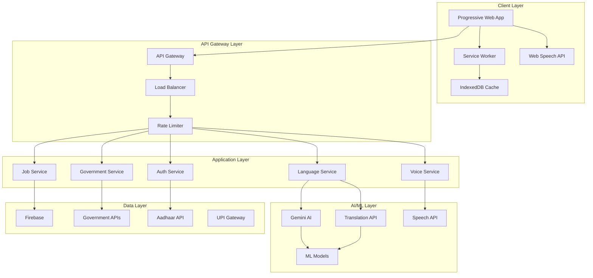
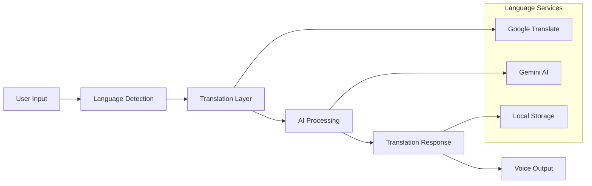

# Design Document: AI for Bharat CareerCompass Enhancements

## Overview

The AI for Bharat CareerCompass enhancements transform the existing career platform into an inclusive, accessible system that addresses India's unique employment challenges. The design leverages modern web technologies, AI-powered language processing, and government API integrations to create a comprehensive solution for India's diverse population.

### Key Design Principles

1. **Inclusive by Design**: Multi-language support with regional language processing
2. **Offline-First**: Core functionality available without internet connectivity
3. **Accessibility-First**: WCAG 2.1 AA compliance for users with disabilities
4. **Progressive Enhancement**: Enhanced features for better connectivity/devices
5. **Cultural Sensitivity**: Respect for India's diverse cultural and linguistic landscape
6. **Government Integration**: Seamless connection with official schemes and services

### Technology Stack Integration

Building on the existing CareerCompass foundation:

- **Frontend**: Next.js 14+ with TypeScript, enhanced with PWA capabilities
- **AI/ML**: Google Gemini AI extended with multi-language processing
- **Database**: Firebase with offline synchronization capabilities
- **Authentication**: Enhanced with Aadhaar/PAN integration
- **UI Framework**: Existing design system extended with accessibility features
- **New Additions**: Service Workers, IndexedDB, Web Speech API, Translation APIs

## Architecture

### High-Level Architecture



### Offline-First Architecture

The system implements a comprehensive offline-first strategy:

1. **Service Worker Layer**: Intercepts network requests and manages caching strategies
2. **IndexedDB Storage**: Local database for offline data persistence
3. **Background Sync**: Queues actions for execution when connectivity returns
4. **Progressive Sync**: Intelligent data synchronization based on connection quality

### Multi-Language Processing Pipeline



## Components and Interfaces

### Core Components

#### 1. Language Service Component

**Purpose**: Handles multi-language support and translation services

**Interface**:

```typescript
interface LanguageService {
  detectLanguage(text: string): Promise<LanguageCode>;
  translateText(text: string, targetLang: LanguageCode): Promise<string>;
  translateJobListing(
    job: JobListing,
    targetLang: LanguageCode,
  ): Promise<JobListing>;
  getSupportedLanguages(): LanguageCode[];
  cacheTranslation(
    original: string,
    translated: string,
    lang: LanguageCode,
  ): void;
}

type LanguageCode =
  | "en"
  | "hi"
  | "ta"
  | "te"
  | "bn"
  | "mr"
  | "gu"
  | "kn"
  | "ml"
  | "pa";
```

**Key Features**:

- Integration with Google Translate API for 110+ languages
- Local caching for frequently translated content
- Batch translation for performance optimization
- Fallback mechanisms for offline scenarios

#### 2. Voice Interface Component

**Purpose**: Provides speech-to-text and text-to-speech capabilities

**Interface**:

```typescript
interface VoiceService {
  startListening(language: LanguageCode): Promise<void>;
  stopListening(): Promise<string>;
  speakText(text: string, language: LanguageCode): Promise<void>;
  isListening(): boolean;
  getSupportedVoiceLanguages(): LanguageCode[];
}
```

**Key Features**:

- Web Speech API integration with fallback to cloud services
- Multi-language voice recognition and synthesis
- Noise cancellation and audio processing
- Offline voice processing for basic commands

#### 3. Government Integration Service

**Purpose**: Connects with Indian government APIs and schemes

**Interface**:

```typescript
interface GovernmentService {
  getEligibleSchemes(userProfile: UserProfile): Promise<GovernmentScheme[]>;
  applyToScheme(
    schemeId: string,
    application: SchemeApplication,
  ): Promise<ApplicationResult>;
  trackApplication(applicationId: string): Promise<ApplicationStatus>;
  getSchemeDetails(schemeId: string): Promise<GovernmentScheme>;
  verifyEligibility(
    userId: string,
    schemeId: string,
  ): Promise<EligibilityResult>;
}
```

**Integrated Schemes**:

- PMKVY (Pradhan Mantri Kaushal Vikas Yojana)
- MGNREGA (Mahatma Gandhi National Rural Employment Guarantee Act)
- Startup India
- Stand Up India
- Digital India initiatives
- State-specific employment schemes

#### 4. Digital Identity Service

**Purpose**: Handles Aadhaar and PAN integration for identity verification

**Interface**:

```typescript
interface DigitalIdentityService {
  verifyAadhaar(
    aadhaarNumber: string,
    otp: string,
  ): Promise<AadhaarVerificationResult>;
  verifyPAN(panNumber: string): Promise<PANVerificationResult>;
  getKYCDetails(aadhaarNumber: string): Promise<KYCDetails>;
  linkDigitalIdentity(
    userId: string,
    identityData: DigitalIdentity,
  ): Promise<void>;
}
```

**Security Features**:

- End-to-end encryption for sensitive data
- Compliance with UIDAI guidelines
- Secure token-based authentication
- Privacy-preserving data handling

#### 5. Offline Data Manager

**Purpose**: Manages offline data synchronization and caching

**Interface**:

```typescript
interface OfflineDataManager {
  cacheJobListings(jobs: JobListing[]): Promise<void>;
  getCachedJobs(filters?: JobFilter): Promise<JobListing[]>;
  queueAction(action: OfflineAction): Promise<void>;
  syncPendingActions(): Promise<SyncResult[]>;
  getOfflineCapabilities(): OfflineCapability[];
}
```

**Caching Strategy**:

- Job listings cached by location and category
- User profiles and applications stored locally
- Government scheme information cached for offline access
- Progressive cache updates based on user behavior

#### 6. Accessibility Service

**Purpose**: Ensures WCAG 2.1 AA compliance and assistive technology support

**Interface**:

```typescript
interface AccessibilityService {
  enableHighContrast(): void;
  adjustFontSize(scale: number): void;
  enableScreenReaderMode(): void;
  provideAltText(element: HTMLElement): string;
  announceToScreenReader(message: string): void;
  validateAccessibility(component: React.Component): AccessibilityReport;
}
```

**Accessibility Features**:

- Semantic HTML with proper ARIA labels
- Keyboard navigation support
- Screen reader compatibility
- High contrast mode
- Adjustable font sizes
- Focus management

### Integration Interfaces

#### External API Integrations

1. **Google Translate API**: Multi-language translation services
2. **Aadhaar Authentication API**: Identity verification through UIDAI
3. **UPI Gateway**: Digital payment integration
4. **Government Scheme APIs**: Direct integration with official portals
5. **NSDC API**: Skill development course integration

#### Internal Service Communication

All services communicate through a centralized event bus with typed interfaces:

```typescript
interface ServiceBus {
  publish<T>(event: ServiceEvent<T>): void;
  subscribe<T>(eventType: string, handler: EventHandler<T>): void;
  unsubscribe(eventType: string, handler: EventHandler): void;
}
```

## Data Models

### Enhanced User Profile

```typescript
interface EnhancedUserProfile extends BaseUserProfile {
  // Language preferences
  primaryLanguage: LanguageCode;
  secondaryLanguages: LanguageCode[];

  // Location and accessibility
  location: {
    state: string;
    district: string;
    pincode: string;
    coordinates?: GeolocationCoordinates;
    connectivityLevel: "high" | "medium" | "low";
  };

  // Digital identity
  digitalIdentity: {
    aadhaarLinked: boolean;
    panLinked: boolean;
    aadhaarVerified: boolean;
    panVerified: boolean;
  };

  // Accessibility preferences
  accessibility: {
    screenReaderEnabled: boolean;
    highContrastEnabled: boolean;
    fontSize: "small" | "medium" | "large" | "extra-large";
    voiceEnabled: boolean;
    keyboardNavigation: boolean;
  };

  // Employment background
  employmentType: "formal" | "informal" | "unemployed" | "student";
  informalSkills: InformalSkill[];
  governmentSchemeHistory: SchemeParticipation[];

  // Financial inclusion
  financialProfile: {
    hasUPIAccount: boolean;
    hasBankAccount: boolean;
    creditScore?: number;
    financialLiteracyLevel: "basic" | "intermediate" | "advanced";
  };
}
```

### Multi-Language Job Listing

```typescript
interface MultiLanguageJobListing extends BaseJobListing {
  // Multi-language content
  translations: {
    [key in LanguageCode]?: {
      title: string;
      description: string;
      requirements: string[];
      benefits: string[];
    };
  };

  // Rural and accessibility features
  ruralFriendly: boolean;
  remoteWorkOptions: {
    fullyRemote: boolean;
    hybridOptions: boolean;
    connectivityRequirements: "low" | "medium" | "high";
  };

  // Accessibility information
  accessibilitySupport: {
    wheelchairAccessible: boolean;
    visualImpairmentSupport: boolean;
    hearingImpairmentSupport: boolean;
    flexibleSchedule: boolean;
  };

  // Government scheme alignment
  alignedSchemes: string[];
  eligibilityForSchemes: string[];
}
```

### Government Scheme Model

```typescript
interface GovernmentScheme {
  id: string;
  name: {
    [key in LanguageCode]?: string;
  };
  description: {
    [key in LanguageCode]?: string;
  };

  // Eligibility criteria
  eligibility: {
    ageRange: { min: number; max: number };
    incomeRange: { min: number; max: number };
    educationLevel: string[];
    employmentStatus: string[];
    location: {
      states: string[];
      districts?: string[];
      rural: boolean;
      urban: boolean;
    };
  };

  // Application process
  applicationProcess: {
    documentsRequired: string[];
    applicationDeadline?: Date;
    processingTime: string;
    applicationFee: number;
    onlineApplicationAvailable: boolean;
  };

  // Benefits
  benefits: {
    monetaryBenefit?: number;
    skillTraining: boolean;
    jobPlacement: boolean;
    certificateProvided: boolean;
    duration: string;
  };

  // Metadata
  category:
    | "employment"
    | "skill-development"
    | "entrepreneurship"
    | "financial-inclusion";
  implementingAgency: string;
  lastUpdated: Date;
  isActive: boolean;
}
```

### Voice Interaction Model

```typescript
interface VoiceInteraction {
  id: string;
  userId: string;
  sessionId: string;

  // Voice data
  audioInput: {
    language: LanguageCode;
    transcript: string;
    confidence: number;
    duration: number;
  };

  // Processing results
  intent: {
    type: "job_search" | "profile_update" | "scheme_inquiry" | "help_request";
    confidence: number;
    parameters: Record<string, any>;
  };

  // Response
  response: {
    text: string;
    audioUrl?: string;
    language: LanguageCode;
    followUpRequired: boolean;
  };

  // Metadata
  timestamp: Date;
  processingTime: number;
  offline: boolean;
}
```

### Offline Action Queue

```typescript
interface OfflineAction {
  id: string;
  userId: string;
  type:
    | "job_application"
    | "profile_update"
    | "scheme_application"
    | "message_send";

  // Action data
  payload: Record<string, any>;

  // Sync metadata
  createdAt: Date;
  attempts: number;
  maxAttempts: number;
  priority: "low" | "medium" | "high";
  requiresConnectivity: "low" | "medium" | "high";

  // Status
  status: "pending" | "syncing" | "completed" | "failed";
  lastAttempt?: Date;
  errorMessage?: string;
}
```

### Financial Inclusion Model

```typescript
interface FinancialProfile {
  userId: string;

  // Digital payment integration
  upiDetails: {
    upiId?: string;
    linkedBanks: string[];
    transactionHistory: UPITransaction[];
  };

  // Financial literacy
  literacyAssessment: {
    score: number;
    completedModules: string[];
    certificatesEarned: string[];
    lastAssessmentDate: Date;
  };

  // Microfinance and loans
  creditProfile: {
    creditScore?: number;
    loanHistory: LoanRecord[];
    eligiblePrograms: string[];
    currentApplications: string[];
  };

  // Government financial schemes
  financialSchemes: {
    participatedSchemes: string[];
    eligibleSchemes: string[];
    benefitsReceived: FinancialBenefit[];
  };
}
```

## Correctness Properties

_A property is a characteristic or behavior that should hold true across all valid executions of a system—essentially, a formal statement about what the system should do. Properties serve as the bridge between human-readable specifications and machine-verifiable correctness guarantees._

Based on the prework analysis, the following properties ensure the system meets all requirements across the diverse use cases and inputs:

### Property 1: Multi-Language Processing Consistency

_For any_ supported language and any text input, when the platform processes the text, all related UI elements, translations, and voice outputs should maintain linguistic consistency and accuracy across the entire user journey.
**Validates: Requirements 1.1, 1.2, 1.3, 1.4, 1.5**

### Property 2: Location-Based Job Matching Accuracy

_For any_ user location (rural or urban) and job posting, the platform should return all relevant opportunities within the specified radius and correctly match candidates based on geographic proximity and connectivity requirements.
**Validates: Requirements 2.1, 2.3, 2.5**

### Property 3: Government Scheme Integration Completeness

_For any_ user profile and government scheme, when eligibility criteria are met, the platform should automatically recommend the scheme, provide complete application guidance, and track status throughout the process.
**Validates: Requirements 3.1, 3.2, 3.3, 3.4, 3.5**

### Property 4: Accessibility Compliance Universality

_For any_ platform feature and assistive technology, all interactive elements should be fully accessible through keyboard navigation, screen readers, and alternative input methods while maintaining WCAG 2.1 AA compliance.
**Validates: Requirements 4.1, 4.2, 4.3, 4.4, 4.5, 4.6**

### Property 5: Offline-First Data Synchronization

_For any_ user action performed offline, when connectivity is restored, all data should synchronize correctly without loss, maintaining consistency between local and remote state.
**Validates: Requirements 5.1, 5.2, 5.3, 5.5**

### Property 6: Bandwidth Optimization Effectiveness

_For any_ content type and network condition, when low-bandwidth mode is enabled, data usage should be reduced by at least 70% while maintaining core functionality and prioritizing essential content.
**Validates: Requirements 5.4, 5.6**

### Property 7: Voice Interface Processing Accuracy

_For any_ supported language and voice input, the platform should accurately transcribe speech, convert it to appropriate actions, and provide clear audio feedback with proper error handling and clarification requests.
**Validates: Requirements 6.1, 6.2, 6.3, 6.4, 6.5, 6.6**

### Property 8: Digital Identity Verification Security

_For any_ identity verification attempt using Aadhaar or PAN, the platform should securely authenticate the user, auto-populate verified information, and provide alternative verification methods when primary methods fail.
**Validates: Requirements 7.1, 7.2, 7.3, 7.4, 7.5, 7.6**

### Property 9: Informal Sector Skills Recognition

_For any_ informal sector worker and skill assessment, the platform should accurately evaluate competencies, match them with formal job requirements, and provide relevant upskilling recommendations.
**Validates: Requirements 8.1, 8.3, 8.4, 8.6**

### Property 10: Certificate Generation Consistency

_For any_ completed assessment, course, or training module, the platform should generate verifiable digital certificates that maintain consistent format, security, and verification capabilities across all certificate types.
**Validates: Requirements 8.2, 9.6, 10.4**

### Property 11: Financial Integration Security

_For any_ financial transaction or service integration, the platform should maintain secure connections with UPI/wallet services, provide appropriate guidance, and ensure compliance with financial regulations.
**Validates: Requirements 9.1, 9.2, 9.4, 9.5**

### Property 12: Learning Path Personalization

_For any_ user's skill profile and learning goals, the platform should recommend personalized learning paths, track progress accurately, and suggest relevant opportunities based on completed training.
**Validates: Requirements 10.1, 10.2, 10.3, 10.5, 10.6**

### Property 13: Employer Diversity Tools Effectiveness

_For any_ job posting and employer interaction, the platform should provide inclusive language suggestions, highlight accessibility options, and offer bias-free candidate presentation while supporting diversity goals.
**Validates: Requirements 11.1, 11.2, 11.3, 11.4, 11.5, 11.6**

### Property 14: Community Engagement Facilitation

_For any_ user seeking community support or mentorship, the platform should connect them with appropriate communities and verified mentors while maintaining respectful communication standards and enabling knowledge sharing.
**Validates: Requirements 12.1, 12.2, 12.3, 12.4, 12.5, 12.6**

### Property 15: Rural Employment Categorization

_For any_ job posting in rural-friendly sectors, the platform should correctly categorize opportunities by sector type and provide appropriate integration with rural employment schemes like MGNREGA.
**Validates: Requirements 2.2, 2.4**

### Property 16: Financial Literacy Provision

_For any_ user accessing financial services, the platform should provide comprehensive financial literacy modules covering banking, insurance, and investment basics with appropriate completion tracking.
**Validates: Requirements 8.5, 9.3**

## Error Handling

### Multi-Language Error Handling

**Translation Failures**:

- Fallback to cached translations for common phrases
- Graceful degradation to English when regional language fails
- User notification with option to retry or switch languages
- Offline translation cache for critical UI elements

**Voice Processing Errors**:

- Audio quality assessment before processing
- Multiple recognition attempts with confidence scoring
- Text input fallback for failed voice recognition
- Clear error messages in user's preferred language

### Connectivity and Offline Error Handling

**Network Failures**:

- Automatic retry with exponential backoff
- Queue actions for later synchronization
- Clear offline mode indicators
- Progressive enhancement based on connection quality

**Data Synchronization Conflicts**:

- Conflict resolution with user preference priority
- Timestamp-based merge strategies
- User notification for manual conflict resolution
- Data integrity validation after sync

### Identity Verification Error Handling

**Aadhaar/PAN Verification Failures**:

- Multiple verification attempt allowance
- Alternative document upload options
- Manual verification process escalation
- Clear error messaging with next steps

**Government API Failures**:

- Cached scheme information for offline access
- Alternative application submission methods
- Status update notifications when services resume
- Fallback to manual application processes

### Accessibility Error Handling

**Assistive Technology Failures**:

- Graceful degradation to basic HTML
- Alternative navigation methods
- Clear error announcements for screen readers
- Keyboard shortcut alternatives

**Voice Interface Failures**:

- Text input alternatives always available
- Clear audio error messages
- Visual feedback for voice processing status
- Timeout handling with user notification

## Testing Strategy

### Dual Testing Approach

The testing strategy employs both unit testing and property-based testing to ensure comprehensive coverage:

**Unit Tests**: Focus on specific examples, edge cases, and integration points

- Government API integration edge cases
- Voice processing with background noise
- Offline synchronization conflict scenarios
- Accessibility compliance for specific components
- Multi-language UI element validation

**Property Tests**: Verify universal properties across all inputs using property-based testing

- Language processing consistency across all supported languages
- Location-based matching accuracy with generated coordinates
- Identity verification security with various input formats
- Certificate generation consistency across all types
- Offline synchronization integrity with random action sequences

### Property-Based Testing Configuration

**Testing Framework**: Fast-check for TypeScript/JavaScript property-based testing
**Minimum Iterations**: 100 iterations per property test
**Test Tagging**: Each property test references its design document property

Example test tags:

- **Feature: ai-for-bharat-enhancements, Property 1: Multi-Language Processing Consistency**
- **Feature: ai-for-bharat-enhancements, Property 5: Offline-First Data Synchronization**

### Testing Categories

#### 1. Multi-Language Testing

- **Property Tests**: Language consistency across all supported languages
- **Unit Tests**: Specific translation accuracy for technical terms
- **Integration Tests**: End-to-end user journeys in different languages

#### 2. Accessibility Testing

- **Property Tests**: WCAG compliance across all components
- **Unit Tests**: Screen reader compatibility for specific elements
- **Manual Tests**: Real assistive technology validation

#### 3. Offline Functionality Testing

- **Property Tests**: Data synchronization integrity
- **Unit Tests**: Specific offline scenarios and edge cases
- **Integration Tests**: Complete offline-to-online user journeys

#### 4. Government Integration Testing

- **Property Tests**: Scheme eligibility matching accuracy
- **Unit Tests**: API error handling and fallback scenarios
- **Integration Tests**: Complete application submission workflows

#### 5. Voice Interface Testing

- **Property Tests**: Speech processing accuracy across languages
- **Unit Tests**: Specific voice commands and error conditions
- **Integration Tests**: Complete voice-driven user journeys

#### 6. Performance Testing

- **Load Tests**: Multi-language content serving under load
- **Bandwidth Tests**: Low-bandwidth mode effectiveness
- **Mobile Tests**: PWA functionality across devices

### Test Data Management

**Synthetic Data Generation**:

- Multi-language test content generation
- Realistic user profile creation across demographics
- Government scheme data simulation
- Voice input sample generation

**Privacy-Compliant Testing**:

- Anonymized real user data where permitted
- Synthetic identity data for verification testing
- Compliance with data protection regulations
- Secure test environment isolation

### Continuous Testing Integration

**Automated Testing Pipeline**:

- Property tests run on every commit
- Accessibility tests integrated into CI/CD
- Multi-language validation in staging
- Performance regression detection

**Manual Testing Protocols**:

- Regular accessibility audits with real users
- Multi-language user acceptance testing
- Government scheme integration validation
- Community feedback integration
