# CareerCompass — System Design Document

## 1. Overview

CareerCompass is a full-stack career management platform connecting **job seekers (employees)** with **employers**. It integrates AI-powered career tools, real-time messaging with end-to-end encryption, WebRTC video calls, ATS resume scoring, and Stripe-based subscription billing.

| Layer | Technology |
|---|---|
| **Framework** | Next.js 15 (App Router, Turbopack) |
| **Language** | TypeScript, React 18 |
| **Styling** | Tailwind CSS, Radix UI, Framer Motion, GSAP |
| **Backend / BaaS** | Firebase (Auth, Firestore, Storage) |
| **AI Engine** | Google Genkit + Google AI |
| **Payments** | Stripe (Checkout, Webhooks) |
| **Real-time Comms** | WebRTC (peer-to-peer video), Firestore (signaling & chat) |
| **Email** | Resend |
| **Media** | Cloudinary |

---

## 2. High-Level Architecture

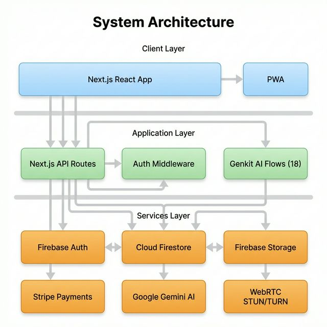

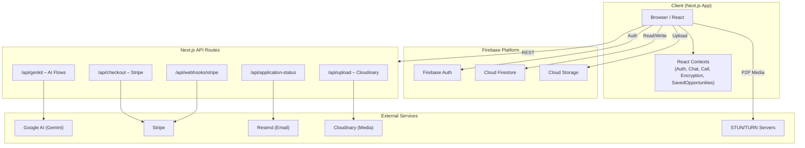

---

## 3. Route & Page Architecture

The app uses Next.js App Router with **route groups** to separate layout concerns:

```
src/app/
├── layout.tsx              # Root layout (AuthProvider, ThemeProvider)
├── page.tsx                # Landing page
├── globals.css
│
├── (auth)/                 # Auth route group (no sidebar)
│   ├── login/page.tsx
│   └── signup/page.tsx
│
├── (app)/                  # Main app group (sidebar + nav)
│   ├── layout.tsx          # AppSidebar, CallProvider, ChatProvider, EncryptionProvider
│   ├── dashboard/          # Employee dashboard
│   ├── employer/           # Employer dashboard, postings, analytics, profile
│   ├── opportunities/      # Browse & apply to jobs
│   ├── applications/       # View submitted applications
│   ├── applied/            # Applied jobs tracker
│   ├── saved/              # Saved opportunities
│   ├── chat/               # Messaging
│   ├── inbox/              # Notifications
│   ├── profile/            # User profile
│   ├── analytics/          # Career analytics
│   ├── users/              # User profiles
│   ├── checkout/           # Subscription checkout
│   └── ai-tools/           # AI career tools suite
│       ├── resume-builder/
│       ├── cover-letter/
│       ├── interview-prep/
│       ├── skill-gap/
│       ├── salary/
│       ├── linkedin/
│       └── email-templates/
│
├── video-call/             # Standalone (no sidebar, fullscreen)
│   ├── layout.tsx
│   └── page.tsx
│
├── pricing/                # Pricing page
│
└── api/                    # API routes
    ├── genkit/[...path]/   # AI flow endpoints
    ├── checkout/           # Stripe checkout session
    ├── webhooks/stripe/    # Stripe webhook handler
    ├── upload/             # Cloudinary upload
    └── application-status/ # Status change emails
```

---

## 4. Data Model (Firestore)

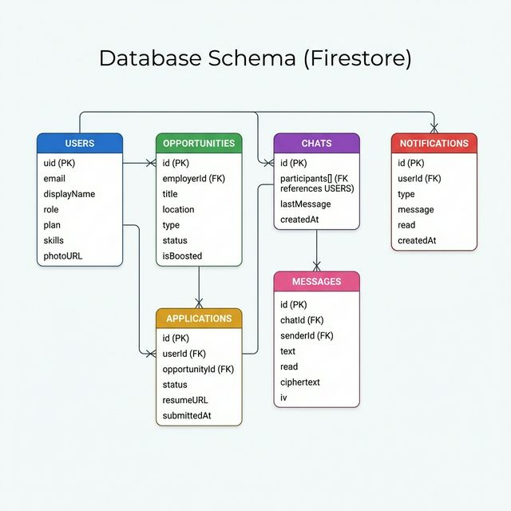

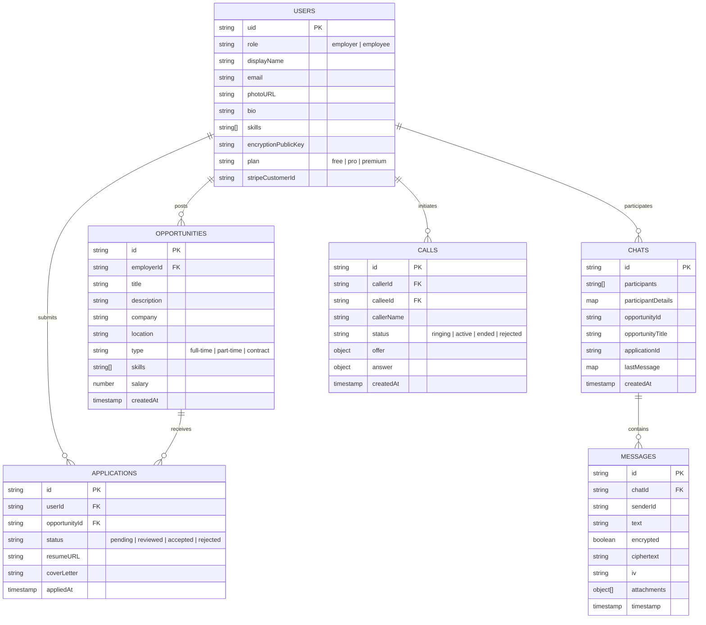

### Firestore Security Rules

| Collection | Create | Read | Update | Delete |
|---|---|---|---|---|
| `users` | Own UID only | Any authenticated | Own UID only | Denied |
| `opportunities` | Employers only | Any authenticated | Owner only | Owner only |
| `applications` | Employees only | Own + employer of job | Denied | Denied |

---

## 5. Authentication & Authorization

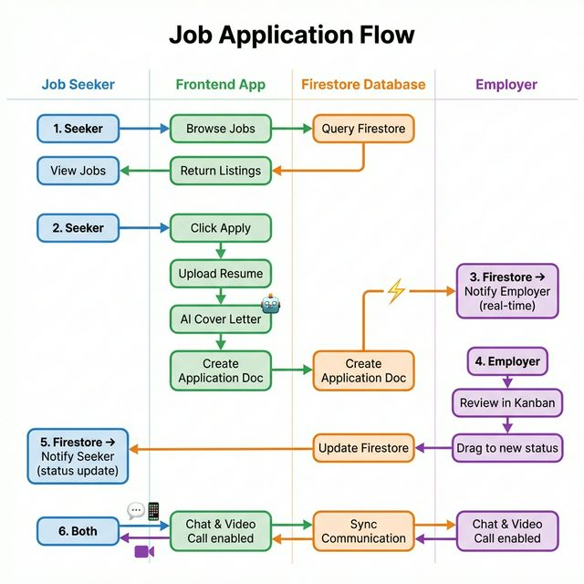

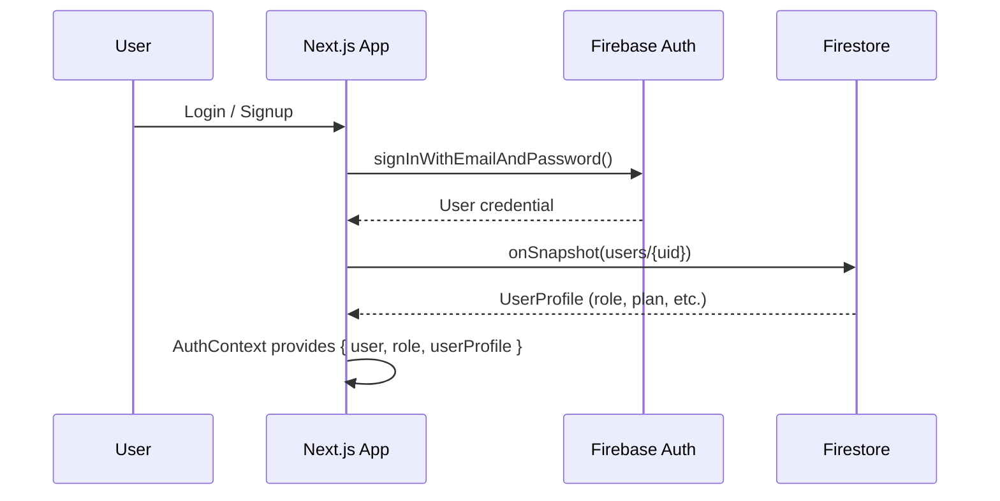

- **Authentication**: Firebase Auth (email/password)
- **Authorization**: Role-based (`employer` / `employee`) stored in Firestore `users` collection
- **Context**: `AuthContext` provides user state app-wide via `useAuth()` hook
- **Route Protection**: Conditional rendering based on `role` in dashboard components

---

## 6. AI Engine (Genkit Flows)

All AI features use **Google Genkit** with the **Google AI (Gemini)** plugin. Flows are defined in `src/ai/flows/` and served via the catch-all API route `/api/genkit/[...path]`.

| Flow | Purpose | Input |
|---|---|---|
| `generate-resume` | AI resume builder with multiple templates | Skills, experience |
| `generate-cover-letter` | Tailored cover letters | Job description, resume |
| `interview-prep` | Mock interview Q&A | Job title, description |
| `skill-gap` | Identify skill gaps | Current skills, target role |
| `job-match` | Match score for opportunities | Resume, job description |
| `salary-negotiation` | Negotiation strategies | Role, experience, location |
| `linkedin-optimizer` | LinkedIn profile optimization | Current profile |
| `parse-resume` | Extract structured data from resume text | Raw text |
| `enhance-text` | Improve writing quality | Draft text |
| `generate-profile-summary` | Auto-generate profile bio | User details |
| `find-and-rank-candidates` | Employer candidate matching | Job requirements |
| `find-matching-candidates` | Quick candidate search | Skills, location |
| `analyze-opportunity-description` | Validate job postings | Description |
| `email-templates` | Generate professional emails | Context |
| `send-welcome-email` | Welcome email on signup | User info |
| `send-application-status-email` | Status change emails | Application data |

### ATS Scoring (`comprehensiveAtsScorer.ts`)

A standalone, client-side ATS scoring engine with:
- **8 weighted categories**: Required skills (30%), experience (20%), preferred skills (15%), education (10%), responsibilities (10%), certifications (5%), job title (5%), keyword density (5%)
- **NLP pipeline**: Tokenization, stemming/normalization, Jaccard similarity
- **Output**: Overall score, category breakdown, gap analysis, improvement suggestions

---

## 7. Real-Time Communication

### 7.1 Messaging (End-to-End Encrypted)

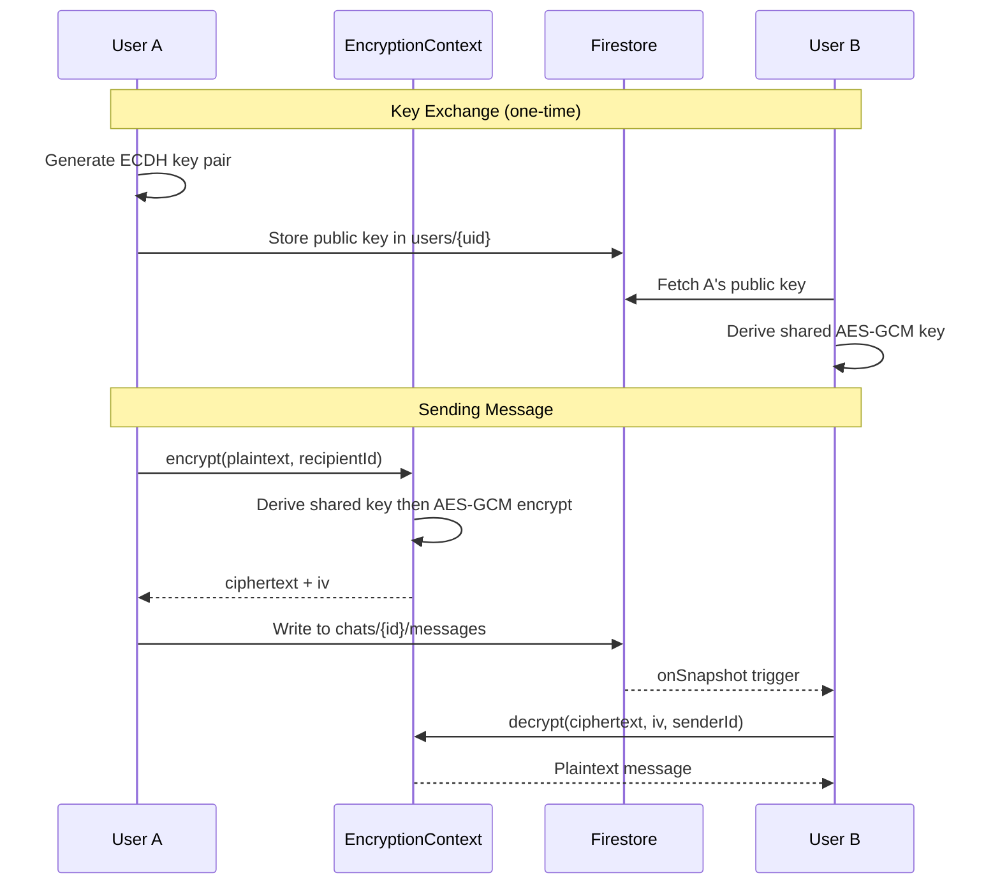

- **Key Exchange**: ECDH (P-256) key pairs, public keys stored in Firestore, private keys in IndexedDB
- **Encryption**: AES-GCM with derived shared keys
- **Storage**: Encrypted ciphertext + IV stored in Firestore messages
- **Attachments**: Uploaded to Firebase Storage, URLs stored in messages

### 7.2 Video Calls (WebRTC)

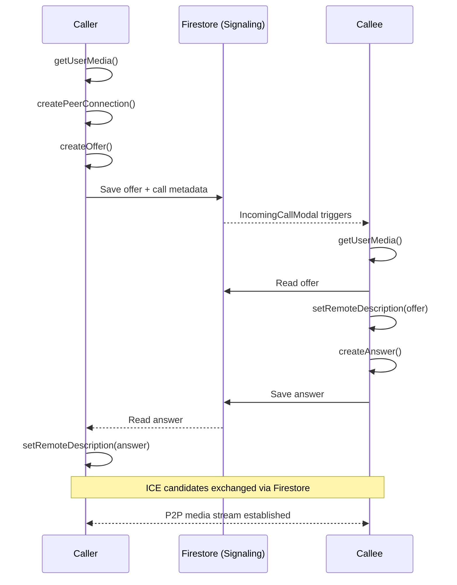

- **Signaling**: Firestore `calls` collection (offer/answer/ICE candidates)
- **NAT Traversal**: Google STUN + OpenRelay TURN servers
- **UI**: Fullscreen immersive layout (`/video-call` route, no sidebar)
- **Features**: Camera/mic toggle, call timer, auto-hiding glassmorphism controls

---

## 8. Payments (Stripe)

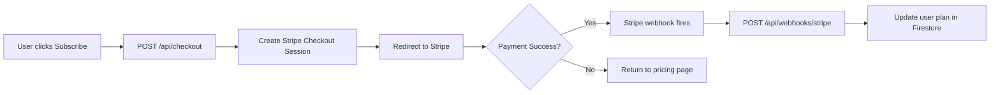

| Plan | Monthly | Yearly | Target |
|---|---|---|---|
| **Pro** | $9.99 | $6.99/mo | Job seekers |
| **Premium** | $19.99 | $14.99/mo | Job seekers |
| **Starter** | $49.00 | $39.00/mo | Employers |
| **Business** | $149.00 | $119.00/mo | Employers |

---

## 9. Security Architecture

| Layer | Mechanism |
|---|---|
| **Authentication** | Firebase Auth (email/password, session management) |
| **Authorization** | Firestore security rules (role-based) |
| **Data at Rest** | Firestore encryption (Google-managed) |
| **Chat Messages** | End-to-end encryption (ECDH + AES-GCM) |
| **Key Storage** | Private keys in IndexedDB (client-only) |
| **API Security** | CSRF tokens, rate limiting, input sanitization |
| **Input Validation** | Zod schemas, HTML sanitization |
| **Video Calls** | Encrypted P2P streams (WebRTC DTLS-SRTP) |

### Security Modules

- `crypto.ts` — ECDH key pair generation, AES-GCM encrypt/decrypt
- `key-storage.ts` — IndexedDB-based private key persistence
- `csrf.ts` — CSRF token generation and validation
- `rate-limit.ts` — API rate limiting
- `sanitize.ts` — Input sanitization and XSS prevention
- `api-auth.ts` — API route authentication helpers
- `session.ts` — Session management utilities

---

## 10. Context Architecture

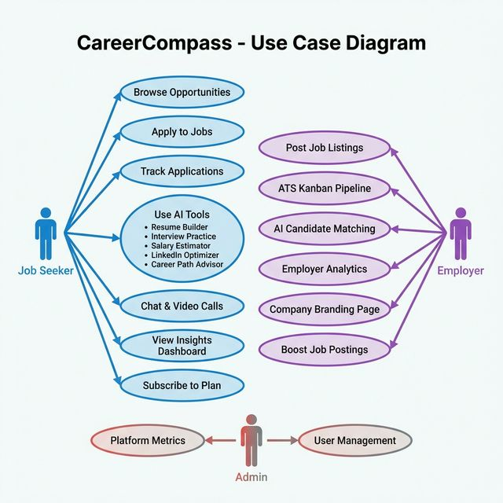

The app uses 5 React Contexts for global state management:

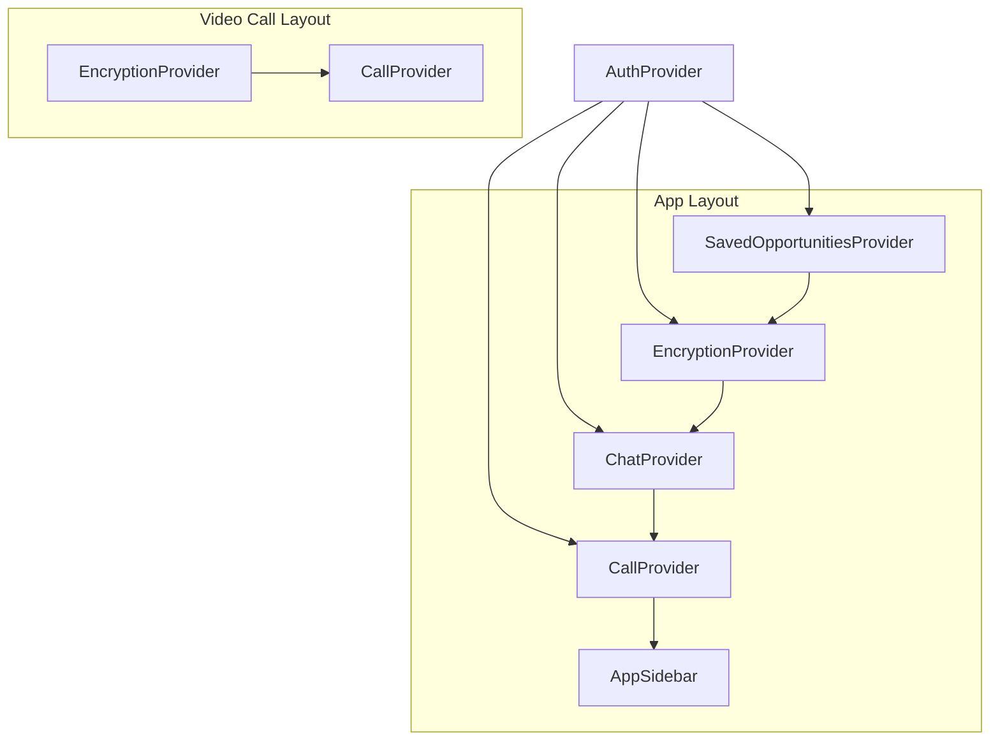

| Context | Responsibility |
|---|---|
| `AuthContext` | Firebase auth state, user profile, role |
| `ChatContext` | Chat list, messages, real-time subscriptions, send/read messages |
| `CallContext` | Incoming call detection, accept/reject call flow |
| `EncryptionContext` | E2E encryption key management, encrypt/decrypt operations |
| `SavedOpportunitiesContext` | Bookmarked job opportunities |

---

## 11. Component Architecture

```
src/components/
├── ui/                         # 67 reusable UI primitives (Radix-based)
│   ├── button, input, dialog, card, tabs, toast, etc.
│   ├── animated-gradient-background, animated-characters
│   ├── pricing-section, pricing-tab, payment-form
│   └── action-search-bar, advanced-chat-input
│
├── chat/                       # Chat feature components
│   ├── ChatWindow.tsx          # Main chat interface
│   └── ChatList.tsx            # Conversation list
│
├── resume-builder/             # Resume builder components (10 files)
│
├── app-sidebar.tsx             # Main navigation sidebar
├── search-bar.tsx              # Global search
├── user-nav.tsx                # User navigation dropdown
├── IncomingCallModal.tsx       # Incoming video call modal
├── notifications-dropdown.tsx  # Notifications
├── theme-toggle.tsx            # Light/dark mode
└── followers-modal.tsx         # Social followers
```

---

## 12. Deployment Architecture

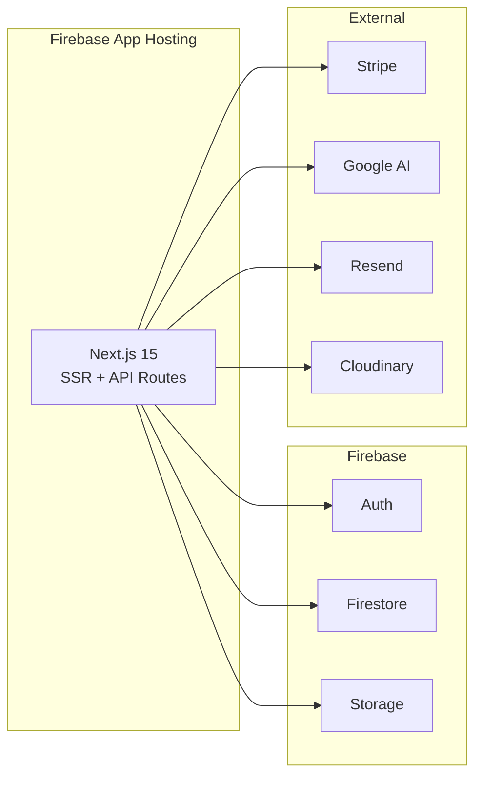

- **Hosting**: Firebase App Hosting (configured via `apphosting.yaml`)
- **Build**: Next.js production build with Turbopack
- **Environment**: Variables managed via `.env` (Firebase, Stripe, Google AI, Resend, Cloudinary keys)

---

## 13. Key Design Decisions

| Decision | Rationale |
|---|---|
| **Firebase as BaaS** | Real-time listeners, built-in auth, serverless scaling, rapid development |
| **Genkit for AI** | First-class Google AI integration, type-safe flows, built-in observability |
| **Client-side E2E encryption** | Messages never readable by server; privacy-first architecture |
| **WebRTC with Firestore signaling** | No custom signaling server needed; leverages existing Firestore infra |
| **Standalone video route** | Fullscreen experience without sidebar; independent layout from app shell |
| **Radix UI primitives** | Accessible, composable, unstyled components with Tailwind customization |
| **Role-based route groups** | Clean separation of employer vs employee features via Next.js route groups |

---

## 14. Environment Variables

| Variable | Service | Purpose |
|---|---|---|
| `NEXT_PUBLIC_FIREBASE_*` | Firebase | Client-side Firebase config (6 vars) |
| `FIREBASE_ADMIN_*` | Firebase Admin | Server-side Firebase access |
| `STRIPE_SECRET_KEY` | Stripe | Server-side payment processing |
| `STRIPE_WEBHOOK_SECRET` | Stripe | Webhook signature verification |
| `STRIPE_*_PRICE_ID` | Stripe | Plan price IDs (8 vars) |
| `GOOGLE_GENAI_API_KEY` | Google AI | Genkit AI model access |
| `RESEND_API_KEY` | Resend | Transactional emails |
| `CLOUDINARY_*` | Cloudinary | Image/file uploads |
| `NEXT_PUBLIC_APP_URL` | App | Base URL for links |
